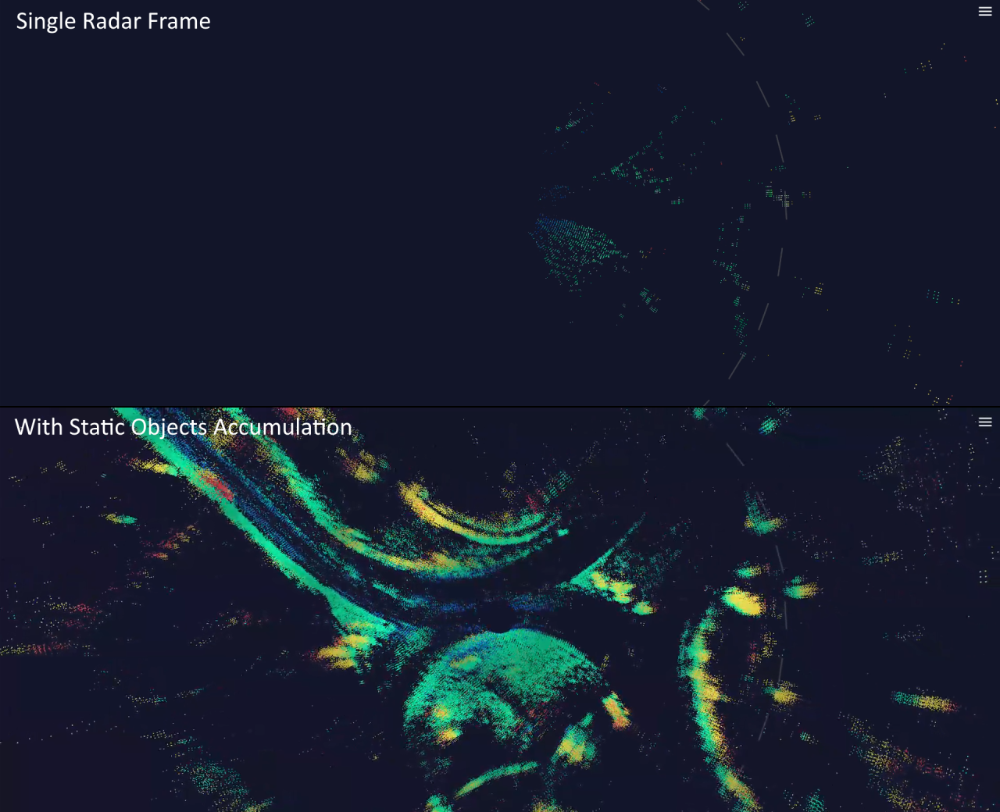

# provizio_dds

C++ and Python library for [DDS communication](https://www.dds-foundation.org/what-is-dds-3/) in Provizio customer
facing APIs and internal Provizio software components. Built using
[eProsima Fast-DDS](https://www.eprosima.com/index.php/products-all/eprosima-fast-dds) DDS implementation (Apache
License 2.0).

Although based directly on a DDS, it's compatible with [ROS2](https://docs.ros.org/en/rolling/) and provides all ROS2
built-in data types.

| CI Status: master | CI Status: develop |
| ----------------- | ----------------- |
|  |  |

## Provizio DDS API

[Table of DDS topics and their respective data types used in Provizio API](https://github.com/provizio/provizio_dds_idls/blob/master/TOPICS.md)

## Build dependencies

**Common:**

- Linux or macOS
- CMake
- Git
- C++ 14 compiler
- libssl-dev
- When Fast-DDS installation is present it will be used, otherwise downloaded and built automatically

**Python:**

- All in **Common** list
- Python 3
- Pip 3
- SWIG 4+
- libpython3-dev
- setuptools
- numpy>=1.16

There is a convenience Bash script to install all dependencies in *apt*-featuring Linux and macOS. In Linux it's to be executed with root privileges, f.e. using `sudo`.

Use as:

```Bash
<PATH_TO_PROVIZIO_DDS>/install_dependencies.sh [PYTHON=OFF|ON] [STATIC_ANALYSIS=OFF|ON] [INSTALL_ROS=OFF|ON] [FAST_DDS_INSTALL=OFF|ON|install_path]
```

Or download and execute (assuming `curl` is present):

```Bash
curl -s https://raw.githubusercontent.com/provizio/provizio_dds/<BRANCH_OR_TAG>/install_dependencies.sh | [sudo] bash -s [PYTHON=OFF|ON] [STATIC_ANALYSIS=OFF|ON] [INSTALL_ROS=OFF|ON] [FAST_DDS_INSTALL=OFF|ON|install_path]
```

For example, for Python-enabled builds from non-root Linux user:

```Bash
curl -s https://raw.githubusercontent.com/provizio/provizio_dds/master/install_dependencies.sh | sudo bash -s ON
```

## Importing

**C++ (CMake):**

```CMake
# Resolve provizio_dds (https://github.com/provizio/provizio_dds)
set(PROVIZIO_DDS_BINARY_DIR "${CMAKE_CURRENT_BINARY_DIR}/provizio_dds_build")
set(PROVIZIO_DDS_SOURCE_DIR "${CMAKE_CURRENT_BINARY_DIR}/provizio_dds")
set(PROVIZIO_DDS_PREFIX "${CMAKE_CURRENT_BINARY_DIR}")
set(PROVIZIO_DDS_GITHUB_PROJECT "provizio/provizio_dds")
set(PROVIZIO_DDS_GITHUB_BRANCH "master") # Or a specific tag or branch you prefer
set(PROVIZIO_DDS_INSTALL_DIR "${PROVIZIO_DDS_BINARY_DIR}/install")
ExternalProject_Add(libprovizio_dds
    GIT_REPOSITORY "https://github.com/${PROVIZIO_DDS_GITHUB_PROJECT}.git"
    GIT_TAG "${PROVIZIO_DDS_GITHUB_BRANCH}"
    PREFIX "${PROVIZIO_DDS_PREFIX}"
    SOURCE_DIR "${PROVIZIO_DDS_SOURCE_DIR}"
    BINARY_DIR "${PROVIZIO_DDS_BINARY_DIR}"
    CMAKE_ARGS "-DCMAKE_BUILD_TYPE=${CMAKE_BUILD_TYPE}" "-DCMAKE_INSTALL_PREFIX=${PROVIZIO_DDS_INSTALL_DIR}" "-DENABLE_CHECK_FORMAT=OFF" "-DENABLE_TESTS=OFF"
)
add_dependencies(<YOUR_CMAKE_TARGET> libprovizio_dds)
target_include_directories(<YOUR_CMAKE_TARGET> SYSTEM PUBLIC "${PROVIZIO_DDS_INSTALL_DIR}/include")
target_link_directories(<YOUR_CMAKE_TARGET> PUBLIC "${PROVIZIO_DDS_INSTALL_DIR}/lib")
target_link_libraries(<YOUR_CMAKE_TARGET> PUBLIC provizio_dds provizio_dds_types fastrtps fastcdr)
```

**Python (pip):**

```Bash
python3 -m pip install -v git+https://github.com/provizio/provizio_dds.git
```

or

```Bash
python3 -m pip install -v git+https://github.com/provizio/provizio_dds.git@TAG_or_BRANCH
```

## Publishing Data

**C++ Example:**

```C++
#include "provizio/dds/publisher.h"
#include <std_msgs/msg/StringPubSubTypes.h>

int main()
{
    // Make a DDS Publisher
    auto publisher = provizio::dds::make_publisher<
        std_msgs::msg::StringPubSubType>(           // DDS Pub/Sub Type
        provizio::dds::make_domain_participant(),   // DDS Domain Participant
        "rt/chatter"                                // DDS Topic Name
    );

    // Create a message
    std_msgs::msg::String str;
    str.data("Hello World!");

    // Publish the message
    publisher->publish(str);

    return 0;
}
```

For more details see [provizio/dds/publisher.h](include/provizio/dds/publisher.h).

**Python Example:**

```Python
import provizio_dds

# Make a DDS Publisher
publisher = provizio_dds.Publisher(
    provizio_dds.make_domain_participant(), # DDS Domain Participant
    "rt/chatter",                           # DDS Topic Name
    provizio_dds.StringPubSubType)          # DDS Pub/Sub Type

# Create a message
message = provizio_dds.String()
message.data("Hello World!")

# Publish the message
publisher.publish(message)
```

For more details see [python/provizio_dds.py](python/provizio_dds.py) and [test/python/python_publisher.py](test/python/python_publisher.py).

## Receiving Data

**C++ Example:**

```C++
#include "provizio/dds/subscriber.h"
#include <std_msgs/msg/StringPubSubTypes.h>
#include <iostream>

int main()
{
    // Make a DDS Subscriber
    const auto subscriber = provizio::dds::make_subscriber<
        std_msgs::msg::StringPubSubType>(           // DDS Pub/Sub Type
        provizio::dds::make_domain_participant(),   // DDS Domain Participant
        "rt/chatter",                               // DDS Topic Name
        [&](const std_msgs::msg::String &message) { // Message handler (takes DDS Data Type as a const reference)
            // Print the received message
            std::cout << message.data() << std::endl;
        });
    std::cin.get(); // Wait for any user input

    return 0;
}
```

For more details see [provizio/dds/subscriber.h](include/provizio/dds/subscriber.h).

**Python Example:**

```Python
import provizio_dds

subscriber = provizio_dds.Subscriber(
    provizio_dds.make_domain_participant(), # DDS Domain Participant
    "rt/chatter",                           # DDS Topic Name
    provizio_dds.StringPubSubType,          # DDS Pub/Sub Type
    provizio_dds.String,                    # DDS Data Type
    lambda message: print(message.data()))  # Message handler (takes a DDS Data Type object), prints the received message
input("Press Enter to continue...") # Wait for any user input
```

For more details see [python/provizio_dds.py](python/provizio_dds.py) and [test/python/python_subscriber.py](test/python/python_subscriber.py).

## Points Accumulation and Multi-Radar Fusion

Point clouds accumulation keeps some of reflected points (normally ones from static objects) "visible" for a number of frames after they were originally received. It makes point clouds much denser and features of objects much clearer - similar to long exposure of dark scenes in photography. Usually, accumulation requires at least 2 types of inputs: point clouds and localization (both odometry and GNSS are supported). In case of static ego or single frame multi-radar fusion, accumulation can be used without odometry/localization inputs. When Provizio radar odometry is used it effectively turns into a SLAM (Simultaneous Localization and Mapping) solution, but external localization/odometry source is also supported.
Accumulation is also used for fusion of point clouds from multiple radars in a vehicle. In this case sensors extrinsics calibration data is required.

### Example of Point Clouds Accumulation



### Python Example

```Python
import provizio_dds

max_accumulate_frames_per_radar = 30
# By default, relies on rt/provizio_radar_odometry as a localization data source and rt/provizio_extrinsics as sensors extrinsics data source
points_accumulator = provizio_dds.accumulation.DDSPointCloudsAccumulator(max_accumulate_frames_per_radar)

# Then some time later, when data was received
print(f"Accumulated, relative to the local frame:")
for point in points_accumulator.get_points_local_frame_relative():
    print(f"x = {point.position[0]}, y = {point.position[1]}, z = {point.position[2]}, ground_relative_velocity = {point.ground_relative_velocity}, snr = {point.snr}")
print(f"Accumulated, relative to the current ego position:")
for point in points_accumulator.get_points_ego_relative():
    print(f"x = {point.position[0]}, y = {point.position[1]}, z = {point.position[2]}, ground_relative_velocity = {point.ground_relative_velocity}, snr = {point.snr}")
```

For more details see [python/accumulation.py](python/accumulation.py) and [test/python/accumulation_test.py](test/python/accumulation_test.py).
